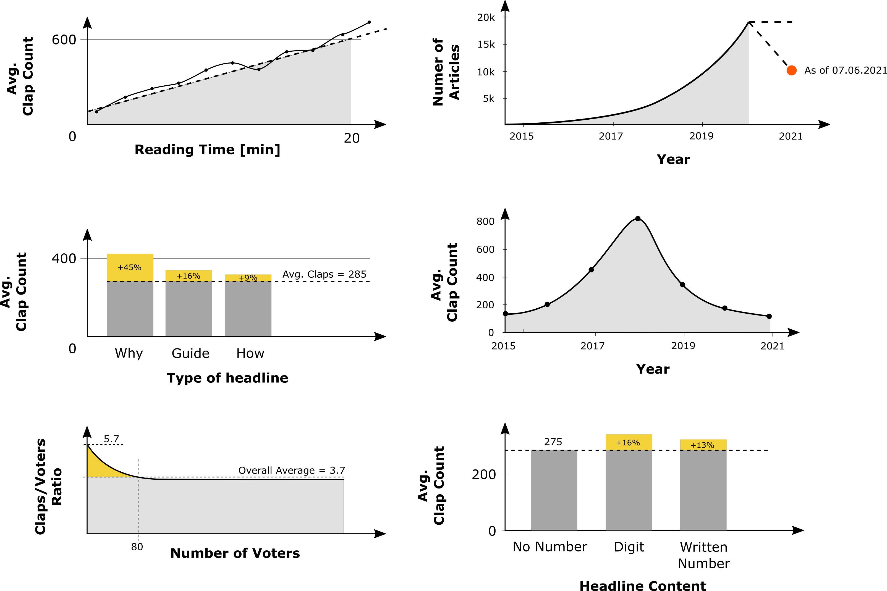

# Medium Analysis

Includes some functions for collecting various data from the online publishing platform Medium (medium.com). I push the results into a Postgres database and use it for various analyses in Tableau.

1. Create Virtualenv
```bash
python3 -m venv /path/to/new/virtual/environment
```
2. Install requirements
```bash
pip install -r requirements.txt
```
3. Create database "medium" on your Postgres Server

5. Change Database Settings in medium_scraper/settings.py

5. Migrate to apply Django data model to database "medium"
```bash
python3 manage.py migrate
```

In case you are working in the terminal using psql to interact with your database, you can use the following two comands to backup and restore the data:

Restore Database backup in your postgres database
```bash
pg_restore -U postgres -C -d medium backup_file.tar
```

Creating a backup use:
```bash
pg_dump -U postgres -W -F t medium > database_backup\backup_file.tar
```


## Used Libraries and Tools

* Python: SQLAlchemy, Requests, BeautifulSoup
* SQL: Postgres
* Visualization: Tableau

## Analysis



## License
[MIT](https://choosealicense.com/licenses/mit/)
